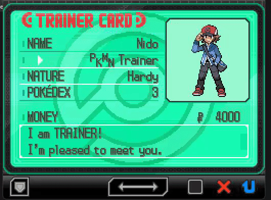
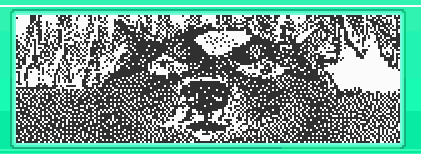
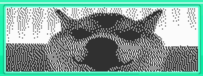

# bw-signature-injector

A simple tool for injecting images into your trainer card in any generation 5 Pokemon game.

## How does it work?

Despite only allowing you to draw in black-and-white, the trainer card signature shares a palette with the rest of the trainer card, allowing for around 146 unqiue colours to be used.

## How to use

- Use `install_pillow.bat` to install the required PIL Imaging Library for this to work
- In the .py script, replace `filename` with the name of your image, and `version` with either `bw` or `b2w2`. Both games use different palettes, so this ensures that the resulting image looks correct
- Run the script and copy the resulting hex values
- Open your trainer card and paste the copied values at address `0x2817A8` for BW or `0x2802E0` for B2W2 of the game's Main RAM

_Congrats! You have now done something that should have never been made possible!_

## Important info

- If the image values aren't imported starting _exactly_ at the correct offset, the game will freeze.
- Non-grayscale images are reset to black-and-white once the trainer card menu is closed, and will probably look terrible. If you want something that looks good long-term, set `grayscale` to `True` in the python script before running, and the image will be saved exactly how it looks when you import it. 
- In these games, the trainer card changes colour at different milestones. I have no idea if this changes the palette and would therefore ruin the coloured images.

| Yuck. Gross.  | Nice and clean.  |
| ------------- | ------------- |
|   |  |
| _A coloured image converted by the game_  | _An image imported as grayscale_  |
